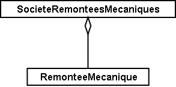
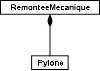
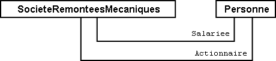
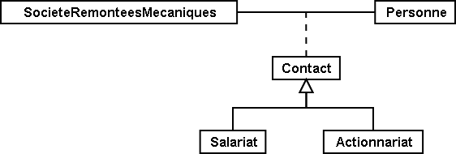
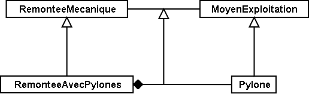

[#_6_13]
=== Zones tarifaires, messages d'état – Relations

[#_6_13_1]
==== Rôles

Qu'est donc une société de remontées mécaniques pour une ligne particulière ? Son propriétaire ? Non, son exploitant !

Dans la relation liant la société de remontées mécaniques à une ligne particulière, l'entreprise endosse le rôle d'exploitant.

Sur le graphique, le nom du rôle figure à l'extrémité du trait de relation, du côté de son détenteur, mais il est généralement omis lorsqu'il est identique au nom de la classe.

[source]
----
ASSOCIATION =
  Exploitant -- {1} SocieteRemonteesMecaniques;
  Ligne_Remontee -- {*} RemonteeMecanique;
END;
----

Figure 48 : Il est possible, selon ce modèle, de s'enquérir de l'exploitant d'une remontée mécanique. « Exploitant » est un _rôle_ que la classe des « sociétés de remontées » mécaniques endosse vis-à-vis de la classe des « remontées mécaniques ». La relation liant la société de remontées mécaniques et la ligne (remontée mécanique) est indiquée en dessous en notation INTERLIS.

Il est parfaitement normal que le choix des noms de rôles se porte sur des noms identiques à ceux des classes. Dans la relation liant par exemple une remontée mécanique à une zone tarifaire, introduire des noms supplémentaires présente peu d'intérêt. Il en va toutefois différemment lorsqu'une relation lie des objets de la même classe et les noms supplémentaires sont alors bien utiles. On souhaiterait par ailleurs représenter le fait qu'une société de remontées mécaniques possède d'autres entreprises qui sont alors ses filiales.

[source]
----
ASSOCIATION =
  Filiale -- {*} SocieteRemonteesMecaniques;
  Mere -- {0..1} SocieteRemonteesMecaniques;
END;
----

Figure 49 : Une société de remontées mécaniques peut aussi bien être la société mère d'une autre entreprise de transport que l'une de ses filiales. Dans de tels cas, le nom de classe n'est plus approprié en tant que nom de rôle. L'exemple ci-dessus est présenté à gauche dans le formalisme graphique UML et à droite en notation textuelle INTERLIS.

[#_6_13_2]
==== Intensité d'une relation

L'association, l'agrégation et la composition expriment des niveaux d'intensité différents de relations.

* *Association* – La relation entre la zone tarifaire et la remontée mécanique est relativement lâche. Deux objets sont affectés l'un à l'autre sans lien de subordination. L'association est une relation d'égal à égal. En général, la plupart des relations que compte un modèle de données sont des associations ordinaires.
* *Agrégation* – Une remontée mécanique constitue un objet largement autonome. Pourtant, il lui faut toujours être coiffée par une société qui en assure l'exploitation. La ligne est subordonnée à la société de remontées mécaniques.
* *Composition* – Il existe une relation très étroite entre une remontée mécanique et les pylônes qui la soutiennent. Un pylône n'a de sens qu'en conjonction avec une remontée mécanique donnée. La composition est la relation existant entre un tout et ses parties (généralement physiques).

La subdivision en fonction de ces intensités n'est pas toujours simple. Il existe des règles informatiques supplémentaires pouvant parfois simplifier la classification :

* *Supprimer* – La suppression d'une société de remontées mécaniques entraîne la disparition de l'exploitant pour les remontées mécaniques qui lui sont affectées. Si une remontée mécanique est supprimée, tous ses pylônes le sont aussi. La suppression d'un tout efface également toutes les parties en liaison avec lui via une composition.
* *Copier* – En cas de copie d'une société de remontées mécaniques (ce qui, dans la réalité, est loin d'être aussi simple que sur un ordinateur), des copies de toutes les remontés mécaniques qui lui sont affectées sont également générées et subordonnées à la nouvelle entreprise de transport. Pour chaque remontée, des copies de ses pylônes sont également effectuées. La copie d'un objet génère également la duplication des objets qui lui sont associés par le biais d'agrégations et de compositions. Aucune copie n'est en revanche créée pour les objets qui lui sont associés par l'intermédiaire d'associations ordinaires.

.L'association (à gauche), l'agrégation (au centre) et la composition (à droite) sont différents types de relations se différenciant les unes des autres par leurs niveaux d'intensité : un pylône est en relation si étroite avec sa remontée mécanique qu'il peut être interprété comme faisant partie intégrante de la ligne. Comparées à la composition, l'agrégation et l'association sont moins intenses.
image::img/image55.png[]  

La notation INTERLIS est très proche de la représentation graphique. Le nom du rôle doit cependant être figuré lorsqu'il se distingue du nom de la classe.

[source]
----
ASSOCIATION =
  RemonteeMecanique -- RemonteeMecanique;
  ZoneTarifaire -- ZoneTarifaire;
END;

ASSOCIATION =
  Exploitant -<> SocieteRemonteesMecaniques;
  RemonteeMecanique -- RemonteeMecanique;
END;

ASSOCIATION =
  RemonteeMecanique –<#> RemonteeMecanique;
  Pylone -- Pylone;
END;
----

[#_6_13_3]
==== Relations avec attributs

Des billets de divers types donnent le droit d'emprunter des remontées mécaniques exploitées par des entreprises de transport en montagne différentes. D'où la question qui se pose alors : comment le gain résultant de la vente d'un billet est-il ventilé entre les différentes entreprises ? Prenons un exemple : l'abonnement général national permet d'emprunter la ligne de la Dent d'Ili. En contrepartie, l'accord conclu au plan national permet aux Remontées mécaniques de la Dent d'Ili de percevoir 0.13% du chiffre d'affaires global réalisé sur la vente des abonnements généraux.

Les relations peuvent également se voir affecter des attributs de sorte qu'elles peuvent être conçues comme des classes d'un genre un peu spécifique.

[source]
----
ASSOCIATION Pourcentage =
  Participant -- {*} SocieteRemonteesMecaniques;
  TypeBillet -- {*} TypeBillet;

  ATTRIBUTE
    Pourcentage: 0.00 .. 100.00 [Units.Percent];

END Pourcentage;
----

Figure 51 : Une société de remontées mécaniques se voit rétrocéder un pourcentage prédéfini du produit de la vente d'un type de billet donné qui n'est une propriété ni de l'entreprise de transport, ni du type de billet mais bien de la relation qui les unit. De telles situations sont modélisées par l'intermédiaire de classes relationnelles.

[#_6_13_4]
==== Relations multiples

Désireuse d'avoir une vue d'ensemble plus fine de la vente des billets, l'Association nationale souhaiterait pouvoir connaître la ventilation des ventes des différents types de billets, point de vente par point de vente et saison par saison.

[source]
----
ASSOCIATION Vente =
  PointVente –- {*} PointVente;
  Saison –- {*} Saison;
  TypeBillet –- {*} TypeBillet;

  ATTRIBUTE
    Nombre: 1 .. 999999 [Units.CountedObjects];
    Montant: 0.00 .. 9999999.99 [Beotie.Couronne];

END Vente;
----

Figure 52 : La vente est ventilée par points de vente, types de billets et saisons. Il s'agit d'une relation multiple entre trois partenaires égaux (les classes des points de vente, des types de billets et des saisons). La vente est en revanche une classe relationnelle définissant les propriétés de la relation (par exemple le nombre de billets vendus de même que le montant encaissé).

Il existe donc une relation d'égal à égal liant les points de vente, les types de billets et les saisons à laquelle sont en plus affectés deux attributs, à savoir le nombre de billets vendus et le montant encaissé. Cette relation ne lie donc plus deux mais trois classes.

Mais que signifient alors les informations de cardinalité pour de telles relations ? S'agissant par exemple de la saison, la cardinalité (*) nous apprend qu'il peut exister un nombre quelconque d'affectations aux saisons pour une combinaison donnée de type de billet et de point de vente. Si une cardinalité de valeur 1 avait été indiquée à la place, cela aurait signifié qu'un seul type de billet aurait pu être vendu par un seul point de vente durant une seule saison.

C'est un peu compliqué, je vous l'accorde. Mais avons-nous réellement besoin de relations multiples ? Ne pourrait-on pas les réduire à des relations duales ordinaires ?

.Des relations multiples, impliquant donc plusieurs intervenants, peuvent être réduites à des relations duales ordinaires. La classe relationnelle précédente (celle de la vente dans ce cas) devient un partenaire de rang équivalent aux trois autres qui ne sont plus alors qu'en relation directe avec elle.
image::img/image60.png[]

Toutefois, ce modèle laisse moins clairement transparaître le fait que les trois classes (point de vente, type de billet et saison) sont en relation les unes avec les autres.

[#_6_13_5]
==== Relations ordonnées

 Aucun ordre ne peut être dégagé pour les remontées mécaniques affectées à la société des Remontées mécaniques de la Dent d'Ili. La question de savoir si l'affectation du téléphérique doit précéder ou suivre celle de la télécabine est sans véritable objet.

Il est bien sûr possible de répertorier les lignes d'une entreprise par ordre alphabétique, mais ce tri n'est en rien une propriété de la relation entre la société de remontées mécaniques et les lignes qu'elle exploite, il s'agit d'une simple commodité de présentation. D'autres raisons pourraient en revanche justifier un tri : les coûts d'investissements, les durées des trajets, etc.

Ne serait-il toutefois pas judicieux d'enregistrer l'ordre de succession de l'établissement des relations ? Le téléphérique a ouvert le premier, suivi du remonte-pente, de la télécabine, etc. Il serait sans doute plus indiqué dans ce cas de pourvoir la relation de deux attributs supplémentaires, à savoir le début et la fin de l'exploitation. On pourrait même enregistrer les différents exploitants qui se sont succédé au cours des années. Il n'est en revanche pas opportun d'envisager cette relation comme une agrégation.

.On pourrait imaginer recourir à une relation ordonnée afin d'enregistrer l'ordre de mise en service des différentes remontées mécaniques d'une entreprise. Le modèle de la figure suivante semble toutefois plus indiqué.
image::img/image61.png[]

.Le modèle gagne en clarté si l'on recourt à une classe relationnelle, parce qu'il permet facilement de procéder à des exploitations complémentaires. Ainsi, les lignes d'une entreprise peuvent-elles être triées en fonction de la date de la fin de leur exploitation et un programme informatique serait en mesure de préciser l'identité du ou des exploitants successifs de la remontée mécanique.
image::img/image62.png[]

Des considérations du même ordre peuvent s'appliquer à la relation entre la ligne et ses pylônes : l'introduction d'un ordre dans la relation pourrait permettre leur classement de la station inférieure jusqu'à la station supérieure. D'un point de vue conceptuel, il est cependant plus judicieux de gérer un attribut de position pour les pylônes puis de déduire l'ordre de succession de ces positions et du tracé de la ligne.

[WARNING]
Réfléchissez bien avant de déclarer une relation comme étant ordonnée : cet ordre ne peut-il pas se déduire d'attributs de la relation ou des classes concernées ?

Dans quels cas les relations ordonnées se justifient-elles réellement ? La télécabine d'Ili-les-Bains à la Dent d'Ili comporte des cabines qui ne sont pas assujetties à demeure au câble de transport. Elles peuvent être décrochées à la station inférieure ou à la station supérieure puis à nouveau accrochées si le besoin s'en fait sentir. Quelles cabines sont actuellement accrochées au câble et dans quel ordre ?

.Une cabine possède bien un numéro, mais celui-ci ne donne aucune indication sur la position de cette cabine sur le câble. Une relation ordonnée est donc opportune ici.
image::img/image63.png[]

L'ordre est ici requis. Il ne peut pas être fait appel au numéro de la cabine pour l'obtenir, puisque celui-ci identifie simplement une cabine donnée et ne fournit aucune indication sur sa position actuelle sur le câble.

[#_6_13_6]
==== Etendre des relations

Une société de remontées mécaniques est en relation avec un grand nombre de personnes. Les unes sont salariées par elle, les autres détiennent des parts de son capital. Comme précédemment, dans le cas des différents types de remontées mécaniques, diverses possibilités existent pour la modélisation.

L'une de celles-ci consiste à définir deux relations différentes entre la société de remontés mécaniques et les personnes : l'une pour le salariat, l'autre pour l'actionnariat. Si cette distinction peut occasionnellement perdre de son importance (peut-être pour l'envoi, à l'occasion des fêtes de fin d'année, d'un petit train en chocolat), il n'en demeure pas moins qu'une application doit se préoccuper de chacune de ces deux relations.

.Une personne peut être salariée et/ou actionnaire d'une société de remontées mécaniques. Cette situation est ici modélisée par le biais de deux relations différentes. Si l'entreprise souhaite faire un petit cadeau à ses salariés comme à ses actionnaires à l'occasion des fêtes de fin d'année (en leur envoyant des chocolats par exemple), les deux relations devront être exploitées.

Une autre possibilité de modélisation consiste à définir une relation primaire (contact) puis à l'étendre au salariat et à l'actionnariat. Tant qu'une application n'a pas besoin de connaître la nature exacte du lien qu'entretient une personne avec l'entreprise, elle recourt à la relation primaire (contact) et obtient ainsi connaissance de l'ensemble des personnes en contact de quelque nature que ce soit avec l'entreprise. Une application ne concernant que les salariés utilise la relation étendue du salariat et n'obtient connaissance que des personnes salariées par l'entreprise.

.Dans cette variante, la relation entre la société de remontées mécaniques et une personne, quelle qu'elle soit, est modélisée par la classe relationnelle du contact. Le salariat et l'actionnariat constituent alors des formes particulières de contact avec l'entreprise. Quiconque voudra s'enquérir des contacts de l'entreprise obtiendra automatiquement connaissance des salariés et des actionnaires. Les classes relationnelles sont donc extensibles sur le même modèle que les classes d'objets, ce qui se traduit sur le diagramme par la représentation d'une flèche évidée.

On pourrait affiner encore la relation du salariat en introduisant par exemple une extension « direction ».

.La relation entre une entreprise de transport et son directeur (« Direction ») constitue un cas particulier de la relation du « salariat ».
image::img/image66.png[]

Bien souvent, les extensions de relations sont étroitement associées aux extensions de classes d'objets. Au lieu d'affirmer d'emblée qu'une remontée mécanique comprend des pylônes, on parle dans un premier temps de moyens d'exploitation. Ceux-ci sont liés à la ligne par l'intermédiaire d'associations, liens assez lâches. Les pylônes constituant toutefois une propriété constitutive importante de différents types de remontées mécaniques, on introduit la classe RemonteeAvecPylones qui est alors en relation avec les pylônes eux-mêmes. Cette classe est cependant gérée comme une extension de la relation entre les remontées mécaniques et les moyens d'exploitation. Les pylônes étant liés à une remontée mécanique donnée – au contraire par exemple de dameuses –, cette relation se transforme en composition. L'intensité d'une relation ne peut que se renforcer dans le cadre d'une extension et non s'affaiblir, car la relation risquerait alors de se trouver en contradiction avec sa définition de base.

.Il existe une relation ordinaire entre les remontées mécaniques et les moyens d'exploitation qui est renforcée en composition par des classes spécialisées.

[#_6_13_7]
==== Relations dérivables

Lorsque l'estomac crie famine, on est plutôt enclin à choisir une piste de ski en bordure de laquelle on sait pouvoir trouver une auberge. Les pistes et les auberges n'en ont pas pour autant besoin d'être liées par une relation explicite permanente. Il suffit de savoir que l'auberge se trouve à proximité de la piste. Il s'agit donc d'une information pouvant se déduire de la position de l'auberge et du tracé de la piste (tous deux exprimés en coordonnées nationales).

[WARNING]
L'exploitation des informations du modèle ne passe pas nécessairement par l'établissement de relations. Les coordonnées constituent un excellent moyen d'établir les connexions requises, en particulier dans le cas de données à référence spatiale.

Il n'est pas non plus opportun d'intégrer la totalité des relations dérivables dans le modèle conceptuel, raison pour laquelle la relation dérivable entre les auberges et les pistes n'y figure pas.

[WARNING]
Le modèle conceptuel ne doit décrire que les relations implicites d'importance au niveau conceptuel. Les logiciels peuvent ensuite établir des relations supplémentaires, en comparant et en combinant habilement les attributs des objets (et tout particulièrement leur position).

Les relations à définir explicitement dans certains cas et dérivables dans d'autres revêtent une grande importance au plan conceptuel. La dérivation peut se fonder sur la position géographique comme sur d'autres propriétés. Les Ilinois ont par exemple introduit une zone tarifaire spéciale, décrite par une surface et englobant toutes les remontées mécaniques dont les stations inférieure et supérieure se situent dans ses limites.

[source]
----
CLASS ZoneTarifaireDansSecteur EXTENDS NatTour.Billets.ZoneTarifaire =
  Secteur: SurfaceBeotie;
END ZoneTarifaireDansSecteur;
----

La relation entre cette zone tarifaire spéciale et les remontées mécaniques du secteur considéré peut être automatiquement établie au moyen de vues (cf. § <<_6_17>>).

[#_6_14]
