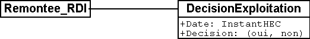

[#_6_15]
=== Quel lien unit les décisions d'exploitation aux remontées ? – Thèmes indépendants

[#_6_15_1]
==== Généralités

Une décision d'exploitation se rapporte toujours à une remontée mécanique donnée. Les deux classes concernées sont ainsi liées par une association.

.Les classes Remontee_RDI et DecisionExploitation sont liées par une association.

Les objets de ces deux classes sont cependant très différents. La mise en service d'une remontée mécanique requiert une somme de travail et d'efforts considérable si ben que ses propriétés sont généralement stables dans le temps. Tout changement de celles-ci (ou des billets) fait l'objet d'une décision de la direction. En revanche, les décisions d'exploitation sont prises quotidiennement et sont du ressort du responsable de l'exploitation.

Le fossé se creuse encore dans le cas des messages d'état générés automatiquement toutes les 20 minutes pour les remontées mécaniques les plus importantes. La saisie et le traitement des données s'opèrent par ailleurs avec des logiciels parfois différents. Il est donc logique que cette situation puisse se traduire dans le concept.

[NOTE]
Les *thèmes* (topics) ordonnent la définition du modèle en fonction des *compétences et du comportement au cours du temps*.

Ainsi s'ouvre une nouvelle possibilité : toutes les données n'ont pas nécessairement à être disponibles sur un système informatique donné, certains thèmes étant simplement lus et jamais modifiés.

[NOTE]
Plusieurs *conteneurs* peuvent exister pour un thème, regroupant les données correspondant à ce thème.

Le système informatique des Remontées mécaniques de la Dent d'Ili comprend par exemple un conteneur pour les remontées mécaniques, un autre pour les billets et un conteneur pour chacun des différents aspects de l'exploitation. L'Association nationale gère également un conteneur pour les remontées mécaniques et un pour les billets. Les Remontées mécaniques de la Dent d'Ili lui transmettent toujours les modifications qui se sont produites dans leurs conteneurs des remontées mécaniques et des billets. Les Remontées mécaniques de la Dent Bleue et toutes les autres entreprises de transport en montagne envoient également leurs modifications à l'Association nationale ou lui transmettent périodiquement une copie de leurs conteneurs de données. L'Association intègre alors les données de ces conteneurs dans les siens.

La subdivision des modèles en différents thèmes permet de bien cibler la livraison des données. Seuls les conteneurs des thèmes présentant un intérêt pour le récepteur lui sont transmis.

[#_6_15_2]
==== Indépendance des thèmes

Si une remontée mécanique est démolie, l'objet de données correspondant est supprimé. La modification est également communiquée à l'Association nationale. Si seul le conteneur des remontés mécaniques est transmis à cette occasion, une contradiction apparaîtra cependant dans les données de l'Association nationale puisque des zones tarifaires liées à cette remontée mécanique subsisteront malgré sa suppression. Manifestement, les relations dépassant les limites d'un thème sont un sujet particulièrement sensible.

[NOTE]
Les thèmes doivent être aussi indépendants les uns des autres que possible. Les relations dépassant les limites des thèmes sont à éviter. Lorsqu'elles existent, elles doivent être identifiées de manière spécifique au sein du modèle.

De telles relations sont assez facilement reconnaissables sur une représentation graphique d'un modèle pour peu que cette dernière désigne clairement les thèmes et les relations. Toute situation de ce type est à identifier par le mot-clé EXTERNAL dans le cas d'une représentation textuelle en notation INTERLIS 2. Elles n'est par ailleurs admise que si les thèmes ont explicitement été déclarés comme étant dépendants (DEPENDS ON). Les dépendances réciproques (même indirectes) ne sont pas permises.

Mais comment éviter des relations 'inter-thèmes' sans pour autant conserver toutes les informations au sein d'un seul et même thème ?

[#_6_15_3]
==== La responsabilité de l'émetteur et du récepteur

La relation entre la décision d'exploitation et la remontée mécanique à laquelle elle se rapporte est cependant inévitable. Il est néanmoins judicieux de gérer les remontées mécaniques et les décisions d'exploitation dans des thèmes distincts. Et dans le cas de cette relation, tout problème d'adéquation entre éléments est exclu par hypothèse, pour la simple raison que la mise à jour des deux thèmes et des conteneurs qui y sont associés est assurée par les Remontées mécaniques de la Dent d'Ili. La possibilité de conflit ne peut toutefois pas toujours être exclue, en particulier lorsque des objets à durée de vie brève sont sollicités via des relations dans différents thèmes.

INTERLIS 2 s'en tient alors à la règle suivante :

[NOTE]
La correction des relations au sein d'un conteneur est de la responsabilité de l'émetteur. Le récepteur doit s'accommoder du fait que des objets intervenant dans une relation dépassant le cadre d'un thème peuvent ne pas être connus à un instant donné. Le récepteur doit néanmoins pouvoir supposer que les relations « inter-thèmes » sont correctes lorsque les versions des conteneurs impliqués sont compatibles.

La première règle, la correction interne d'un conteneur, est également à observer en cas de partition de ce conteneur, pour quelque raison que ce soit.

[#_6_16]
