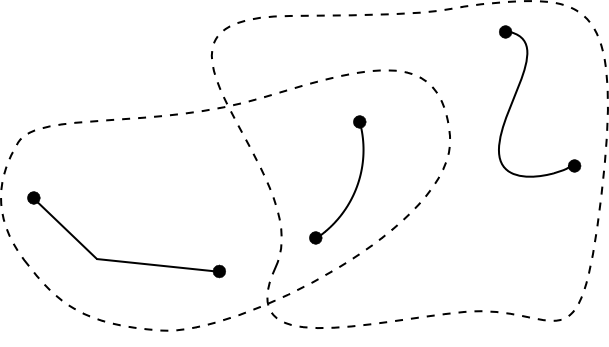
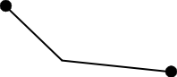
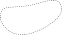
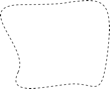

[#_6_17]
=== Les zones tarifaires ne suscitent guère d'intérêt – Vues

[#_6_17_1]
==== Généralités

Lorsqu'il est question de vues dans le contexte de la modélisation, il ne s'agit évidemment pas du panorama qui s'offre au spectateur depuis le sommet de la Dent d'Ili avec la Dent Cambrée en point de mire. Et pourtant, il existe une analogie entre ces deux types de vues. La Dent d'Ili, la Dent Cambrée et l'ensemble des sommets, des vallées et des villages des alentours sont représentés sur la carte topographique, les altitudes étant figurées par des courbes de niveau et des valeurs cotées. La carte ne présente pas directement le panorama du sommet de la Dent d'Ili mais elle contient toutes les informations nécessaires permettant à un lecteur averti d'en déduire la vue depuis le sommet de la Dent d'Ili. La carte permet d'avoir la certitude que la pointe que l'on voit se dresser au loin, à la gauche de la Dent Cambrée, n'est autre que l' « Aiguille Noire ».

Dans notre analogie, les classes d'objets, les structures et les relations d'un modèle correspondent aux éléments de la carte. Elles reproduisent fidèlement la réalité sans qu'un but précis ait été assigné à leur utilisation. Les vues d'un modèle sont comparables au panorama qui s'offre depuis le sommet de la Dent d'Ili. Leur mise en œuvre poursuit toutefois un but précis. Elles se fondent à cet effet sur des informations de base ou sur d'autres vues et les transforment de façon à apporter un soutien optimal à l'obtention du but assigné.

Mais pourquoi de telles vues doivent-elles alors faire partie intégrante du modèle ? Le modèle ne doit tout de même pas anticiper à ce point sur le lieu depuis lequel on profite du panorama, qu'il s'agisse de la Dent d'Ili, de la Dent Cambrée, de l'Aiguille Noire voire du bord du grand bassin, au cœur du jardin des thermes d'Ili-les-Bains.

Dans le contexte d'un modèle, les vues sont avant tout pertinentes pour des règles d'intégrité particulières (cf. § <<_6_14_3>>) et des relations dérivables (cf. § <<_6_13_7>>). Les vues sont également utiles lorsque les données sont à livrer sous une forme traitée pour un but bien spécifique, cas par exemple des données à fournir au service Internet du Val d'Ili. INTERLIS 2 offre de surcroît la possibilité de définir des graphiques. Il est fréquent que des vues et non les données originales elles-mêmes constituent la base de la définition graphique.

[NOTE]
Les *vues* s'appuient sur des classes d'objets ou sur d'autres vues et combinent les objets initiaux de différentes manières pour en faire de nouveaux objets-vues.

Les vues d'INTERLIS sont comparables à celles des systèmes de banques de données.

[#_6_17_2]
==== La loi de formation des vues

Le détail du tracé n'intéressera peut-être pas grand monde, la longueur de la piste suscitera en revanche un vif intérêt. De même, on prête généralement plus d'attention à l'âge d'une personne qu'à sa date de naissance. De telles propriétés peuvent se déduire d'autres informations. Si des propriétés « redondantes » de cette nature étaient saisies comme des données normales, le risque qu'elles ne soient pas toujours parfaitement à jour serait très élevé. L'âge d'une personne par exemple croît inéluctablement d'année en année !

[NOTE]
La propriété la plus importante d'une vue est sa *loi de formation.* Elle définit la manière dont les objets-vues sont générés à partir des objets initiaux.

La vue « PersonneAvecIndicationDeSonAge » est par exemple déduite de la classe d'objets « Personne » que l'on appelle la base. Une PersonneAvecIndicationDeSonAge possède les mêmes propriétés (ALL OF) auxquelles les mêmes valeurs sont associées que la personne initiale. La vue ajoute cependant une propriété supplémentaire « Age ». L'âge, se déduit (:=) de la différence entre l'année de naissance et l'année en cours.

[source]
----
VIEW PersonneAvecIndicationDeSonAge
  PROJECTION OF Personne
  =
  ALL OF Personne;
  Age: 0 .. 150 [y] := Difference (Personne -> AnneeNaissance,
    PARAMETER AnneeEnCours);
END PersonneAvecIndicationDeSonAge;
----

Dans cet exemple, il existe exactement un objet-vue virtuel pour chaque objet de la classe de base : une PersonneAvecIndicationDeSonAge est associée à toute personne.

[NOTE]
La *projection (PROJECTION)* constitue la loi de formation la plus simple pour une vue. Elle s'appuie sur la base, reprend une partie (ou même la totalité) de ses attributs dans un ordre quelconque et peut leur adjoindre des attributs supplémentaires dérivés. Ainsi, elle sert avant tout à transcrire les attributs des objets actuels sous une forme plus propice à leur utilisation.

L'Association nationale des offices de tourisme a défini une classe abstraite de « zone tarifaire ». Les Ilinois ne souhaitent cependant pas répertorier les différentes zones tarifaires dont chacune de leurs lignes fait partie. Ils ont en revanche défini des zones tarifaires géographiquement délimitées décrites par la classe « ZoneTarifaireDansSecteur » dans leur modèle. Cette classe possède une propriété « Secteur » caractérisant la limite géographique du domaine de validité.

Une remontée mécanique dont les stations inférieure et supérieure sont situées dans le secteur couvert par une telle zone tarifaire accepte automatiquement les billets correspondants.

.Quelle remontée mécanique se trouve dans le secteur couvert par quelle zone tarifaire ? Les Ilinois s'intéressent à tous les couples de remontées mécaniques (RM) et de ZoneTarifaireDansSecteur (ZT), pour lesquels deux conditions sont remplies : la station inférieure de la RM doit se trouver dans le secteur de la ZT et la station supérieure de la RM doit aussi se trouver dans le secteur de la ZT.

Mais concrètement, quelle remontée mécanique se trouve dans le secteur de quelle zone tarifaire ? Cette jonction entre remontée mécanique et zone tarifaire peut également être déduite par l'intermédiaire d'une vue.

[NOTE]
La loi de formation d'une vue la plus importante est certainement la *jonction (JOIN)*. Elle joint plusieurs objets de base au sein d'un objet-vue. La jonction revêt une importance particulière en tant que base pour des relations dérivées.

[source]
----
VIEW RemonteesMecaniquesDansSecteur
  JOIN OF RM ~ RemonteeMecanique,
    ZT ~ ZoneTarifaireDansSecteur;
  WHERE InSurface(RM -> PosStationInf, ZT -> Secteur) AND
    InSurface(RM -> PosStationSup, ZT -> Secteur);
  =
END RemonteesMecaniquesDansSecteur;
----

La jonction procède d'abord à la formation de l'ensemble des couples : chacun des objets de la classe RemonteeMecanique est mis en relation avec chacun des objets de la classe ZoneTarifaireDansSecteur pour former un objet-vue virtuel.

La partie WHERE permet de restreindre l'ensemble de tous les objets-vues à ceux pour lesquels les conditions sont remplies. Seuls subsistent alors les couples de remontée mécanique _RM_ et de zone tarifaire _ZT_ pour lesquels les stations inférieure et supérieure de la _RM_ se trouvent dans le secteur de la _ZT_. Sur l'illustration précédente, quatre des six couples possibles (trois remontées x deux zones tarifaires) remplissent les conditions.

[width="65%",cols="^32%,^21%,^47%",]
|===
|Remontée mécanique _RM_ |Zone tarifaire _ZT_ a|
stations inférieure et supérieure de _RM_
dans le secteur de _ZT_ ?

| | |oui
| | |oui
| | |non
| | |non
| | |oui
| | |oui
|===

Figure 63 : Si l'on considère toutes les combinaisons possibles de remontée mécanique _RM_ +
et de zone tarifaire _ZT_ de l'illustration précédente, seules les stations inférieure et supérieure de la _RM_ de quatre d'entre elles (sur un total de six) se trouvent dans le secteur d'une _ZT._

Comme pour une projection, la dernière étape consiste à déterminer les propriétés à posséder par les objets-vues et la manière dont les valeurs associées sont obtenues. Dans la définition INTERLIS précédente, la partie suivant le signe d'égalité sert à cette fin.

Une remontée mécanique n'apparaîtra pas sur la vue si elle ne se trouve dans les limites d'aucune zone tarifaire. Une jonction particulière (dite « *Outer Join* ») permet toutefois d'exiger qu'un objet-vue soit généré même en l'absence de zone tarifaire pour une remontée mécanique donnée. Cette possibilité présente cependant peu d'intérêt dans le contexte des remontées mécaniques et des zones tarifaires de notre application concrète.

Si l'on souhaite répertorier toutes les coordonnées de stations inférieures et supérieures, on se heurte à un obstacle, à savoir au fait que ces coordonnées sont gérées sous forme d'attributs individuels de chacune des remontées mécaniques. L'*union (UNION)* permet cependant de les regrouper au sein d'un ensemble d'objets-vues égaux en droits.

[source]
----
VIEW CoordonneesStations
  UNION OF StationInferieure ~ RemonteeMecanique,
    StationSuperieure ~ RemonteeMecanique;
  =
  Coordonnees: Beotie.CoordNational := StationInferieure -> PosStationInf,
    StationSuperieure -> PosStationSup;
END CoordonneesStations;
----

L'ensemble des objets-vues est ici deux fois plus étendu que celui des remontées mécaniques puisqu'il intègre la totalité des stations inférieures plus la totalité des stations supérieures. Ainsi, l'attribut est défini dans le respect de l'attribut de position de la station inférieure ou de la station supérieure, selon le cas.

L'*agrégation (AGGREGATION)* et l'*inspection (INSPECTION)* sont liées aux attributs de structures. Une agrégation regroupe des objets présentant certaines propriétés identiques au sein d'un objet unique. Les objets considérés jusqu'alors dans l'objet-vue sont disponibles en tant qu'éléments d'un attribut de structure (cf. § <<_6_17_3>>). Une inspection veille au contraire à ce que des éléments structurés donnent naissance à des objets-vues indépendants (cf. § <<_6_14_3>>).

[#_6_17_3]
==== Constitution de vues pas à pas

Pour le contrôle des billets, il est indispensable de connaître les types de billets valables sur chacune des remontées mécaniques. Il serait donc souhaitable de disposer d'un répertoire de toutes les remontées mécaniques indiquant les types de billets valables sur chacune d'entre elles. Les Ilinois désireraient par conséquent définir un modèle proche de ce qui suit, hors données de base :

[source]
----
CLASS TypeBillet =
  Noms: BAG {1..*} OF Designation;
  Prix: 0.00 .. 5000.00 [Beotie.Couronne];
  DureeValidite: Duree;
END TypeBillet;

CLASS RemonteeMecanique =
  Noms: BAG {1..*} OF Designation;
  TypesBilletsValables: BAG OF TypeBillet;
END RemonteeMecanique;
----

Comment dériver ces informations des données originales ? Ce n'est pas si simple. A une remontée mécanique peuvent être affectées plusieurs zones tarifaires, auxquelles sont à leur tour affectés plusieurs types de billets. Il existe en outre des zones tarifaires englobant toutes les remontées mécaniques d'un secteur.

Le dernier aspect de la question est heureusement déjà réglé puisqu'il existe une relation abstraite entre les remontés mécaniques et les zones tarifaires, la validité. Elle est d'une part mise en oeuvre par une relation explicite entre les deux classes (ValiditeExplicite) et la vue RemonteesMecaniquesDansSecteur permet d'autre part de dériver les remontées reconnaissant les billets d'une zone tarifaire donnée sur la base de leur position.

Une vue liant les remontées mécaniques aux types de billets peut alors être définie sur cette base :

[source]
----
VIEW RemonteeMecaniqueEtTypeBilletValable
  JOIN OF RM ~ RemonteeMecanique,
    ZT ~ ZoneTarifaire,
    TB ~ TypeBillet
    V ~ Validite;
  WHERE (V -> RemonteeMecanique == RM) AND (V -> ZoneTarifaire == ZT AND
    (TB -> ZoneTarifaire == ZT);
  =
  NomRemontee: BAG {1..*} OF Designation := RM -> Nom;
  NomBillet: BAG {1..*} OF Designation := TB -> Nom;
  Prix: 0.00 .. 5000.00 [Beotie.Couronne] := TB -> Prix;
  DureeValidite: Duree := TB -> DureeValidite;
END RemonteeMecaniqueEtTypeBilletValable;
----

Cette jonction combine les remontées mécaniques et les types de billets. Elle tient compte de la relation de validité et du fait qu'un type de billet est affecté à une zone tarifaire devant coïncider avec celle de la relation de validité. Ainsi, le but est déjà quasiment atteint. Les combinaisons admissibles de remontée mécanique et de type de billet sont disponibles sous forme d'objets-vues. On souhaiterait encore pouvoir les regrouper par remontée mécanique :

[source]
----
VIEW TypeBilletValableSurRemonteeMecanique
  AGGREGATION OF RMetTBV ~ RemonteeMecaniqueEtTypeBilletValable
  EQUAL (RMetTBV -> RM);
  =
  NomRemontee: BAG {1..*} OF Designation := RMetTBV -> RM -> Nom;
  TypesBillets: BAG OF RemonteeMecaniqueEtTypeBilletValable := AGGREGATES;
END TypeBilletValableSurRemonteeMecanique;
----

Un tel regroupement s'effectue au moyen d'une agrégation. Tous les objets de la vue de base remplissant une condition donnée (à savoir qu'ils appartiennent à la même remontée mécanique) sont regroupés au sein d'un objet-vue. L'ensemble de tous les objets-vues initiaux regroupés au sein d'un tout est à disposition dans ce cadre pour des attributs de structure (AGGREGATES).

[#_6_17_4]
==== Hériter des vues

La définition de la vue présentant l'ensemble des types de billets valables pour chacune des remontées mécaniques (vue TypeBilletValableSurRemonteeMecanique, cf. ci-dessus) a déjà été effectuée par l'Association nationale. Les Ilinois souhaitent pouvoir l'utiliser. Ils désirent cependant pouvoir y intégrer l'attribut de tracé qu'ils ont défini dans leur propre extension de la classe des remontées mécaniques.

[source]
----
VIEW Remontee_RDIEtTypeBilletValable
  EXTENDS RemonteeMecaniqueEtTypeBilletValable
  BASE RM EXTENDED BY ReDI ~ Remontee_RDI
  =
  Trace := ReDI -> Trace;
END Remontee_RDIEtTypeBilletValable;
----

La définition d'une base supplémentaire (laquelle doit être une extension d'une base préexistante) permet de pouvoir accéder aux attributs concernés. Si un objet-vue ne repose pas sur cette extension (s'il ne s'agit donc pas d'une remontée RDI), l'attribut est indéfini.

[NOTE]
Une extension de vue permet de pouvoir consulter les extensions des classes de la vue de base et par suite d'en exploiter les attributs. La loi de formation de la vue ne peut cependant pas être fondamentalement modifiée de la sorte. Il est uniquement possible de définir des sélections supplémentaires.

[#_6_18]
