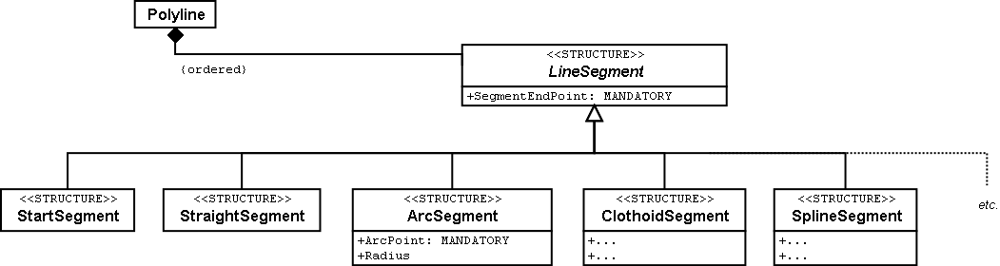
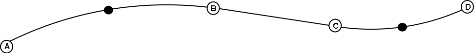
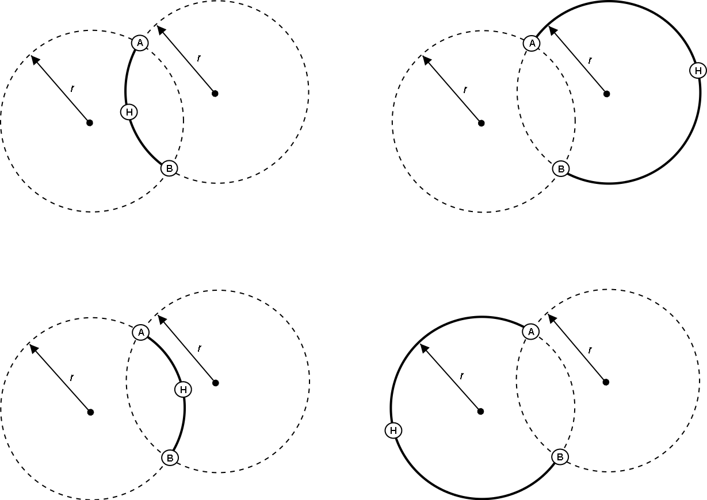

[#_7]
== Pleins feux sur les systèmes du Val d'Ili

[#_7_1]
=== Que signifie la conformité à une norme pour un système ? – Indépendance vis-à-vis de tout système

Les modèles définis au moyen d'INTERLIS 2 sont installés sur différents logiciels tels que NatTourSys de l'Association nationale mais également LiftSys utilisé par les Remontées mécaniques de la Dent d'Ili. Ces systèmes sont donc en mesure de générer et de lire des fichiers correspondants. S'agit-il alors de systèmes INTERLIS ? Ou si l'on veut donner un tour plus général à la question : quand un système est-il conforme à une norme donnée ?

Une description au niveau conceptuel n'a pas vocation à prescrire la manière dont un système informatique implémente la représentation proposée. En règle générale, les systèmes disposent de possibilités propres pour la mise en oeuvre d'applications concrètes. Dans le cas idéal, le modèle de données interne peut directement être dérivé des descriptions. Mais cette condition n'est pas indispensable. Il est parfaitement acceptable qu'un système ne puisse pas traiter directement les descriptions effectuées. Il lui suffit, pour être compatible, d'être directement ou indirectement capable (par exemple via des programmes de conversion supplémentaires) de traiter les données dans le respect de la norme. Une norme régissant la modélisation de données devrait renoncer à prescrire la manière dont un système doit concrètement convertir une application. La créativité des développeurs est alors sollicitée et le marché a les coudées franches. L'indépendance de la norme vis-à-vis de tout système est la condition indispensable pour que des changements de systèmes ne soient pas voués à l'échec pour cause d'incompatibilité avec les données.

Un système n'est pas non plus dans l'obligation de posséder la palette complète des capacités que l'on escompte dans le contexte d'une description. Pour prendre un exemple, WebSys est uniquement en mesure de lire des données INTERLIS 2. La situation est encore plus aiguë dans le cas des systèmes transmettant les messages d'état des différentes remontées mécaniques à la centrale. Les données des messages sont intégrées d'une manière très simple dans des fichiers prétraités, structurés conformément à la norme.

Si une application pose des exigences très particulières, il ne faut pas s'attendre à ce qu'elles soient couvertes par une norme à caractère général. Des contrats doivent donc être conclus avec les producteurs de systèmes pour garantir une assistance dans de telles éventualités. Une certaine réserve est toutefois de mise, dans la mesure où l'on y perd en indépendance vis-à-vis des systèmes tout en limitant par ailleurs le cercle des fournisseurs de systèmes potentiels.

Deux exemples vont servir dans la suite à présenter la manière dont des aspects dépendant des systèmes peuvent être normalisés sans qu'une influence trop forte ne soit exercée sur l'organisation interne de ceux-ci.

[#_7_2]
=== Le cours de l'euro fluctue quotidiennement – Paramètres et fonctions

Le prix est indiqué dans la monnaie nationale pour chacun des types de billets.  Mais il doit également être communiqué en euros et en dollars dans l'intérêt des touristes étrangers. Il ne faudrait toutefois pas que les prix de l'ensemble des types de billets aient à être saisis une nouvelle fois à la moindre fluctuation des taux de change. Ils devraient donc pouvoir se déduire du prix dans la monnaie nationale.

[source]
----
CLASS TypeBillet =
  Nom: Text * 100;
  Prix_COURONNE: 0.00 .. 5000.00 [Beotie.Couronne];
  Prix_EUR: 0 .. 4000 [EUR] := COURONNEenEUR (Prix_COURONNE);
  Prix_USD: 0 .. 4000 [USD] := COURONNEenUSD (Prix_COURONNE);
END TypeBillet;
----

Lorsque les données du système sont à présenter ou à mettre à disposition de WebSys, les prix en euros ou en dollars sont recalculés à partir des prix en monnaie nationale. Le calcul s'effectue au moyen des deux fonctions COURONNEenEUR et COURONNEenUSD. Mais comment LiftSys en particulier et tout système en général peut-il avoir connaissance de l'objet de cette fonction ?

L'information la plus importante au plan conceptuel réside dans le fait que les deux prix en monnaie étrangère ne sont pas traités comme des données indépendantes mais comme une résultante du prix en couronnes. Il suffit par conséquent, pour une fonction donnée, de définir son nom et ses paramètres.

[source]
----
FUNCTION COURONNEenEUR (Couronne: NUMERIC [Beotie.Couronne]): NUMERIC [EUR]
  // Conversion en euros //;
----

L'objectif effectivement assigné à la fonction n'est indiqué que sous forme d'explication entre signes « // ». Son implémentation reste l'affaire des systèmes. De telles définitions sont à limiter à un nombre restreint de modèles de base car elles doivent faire l'objet d'accords passés avec les producteurs de systèmes. Dans INTERLIS 2, l'existence d'un tel accord est signalé par un contrat. Les fonctions ne peuvent être définies que dans des modèles pour lesquels un contrat a été conclu.

[source]
----
CONTRACTED MODEL IlisTour AT http://www.interlis.ch/models/beotie
  VERSION "2008-01" =
  ...
END IlisTour;
----

Les fonctions sont à formuler de la manière la plus générale possible si l'on souhaite que leur nombre reste limité. Pour prendre un exemple, la fonction COURONNEenEUR aurait pu être remplacée par une fonction de division utilisable en toutes circonstances.

[source]
----
FUNCTION Division (Dividende: NUMERIC, Diviseur: NUMERIC): NUMERIC;
----

Il faudrait cependant s'octroyer quelques possibilités de contrôle supplémentaires car on ne dispose d'aucune assurance que la première valeur est un montant exprimé dans la monnaie nationale. La formulation suivante le garantit en revanche.

[source]
----
FUNCTION EnMonnaie (Couronne: NUMERIC [Beotie.Couronne],
                    TauxChange: NUMERIC [Beotie.Couronne]):
  NUMERIC [MONEY];
----

Mais d'où provient le taux de change ? On pourrait envisager que certaines valeurs telles que le cours de l'euro ou du dollar soient disponibles dans les systèmes sous forme de paramètres. Mais comme cela impliquerait à nouveau de s'immiscer dans les systèmes, la définition de paramètres systèmes ne serait autorisée que dans le cadre de contrats.

[source]
----
PARAMETER
  Cours_EUR: 0.000 .. 5.000 [Beotie.Couronne]; !! Valeur d'un euro
                                               !! en couronnes
  Cours_USD: 0.000 .. 5.000 [Beotie.Couronne];

CLASS TypeBillet =
  Nom: Text * 100;
  Prix_COURONNE: 0.00 .. 5000.00 [Beotie.Couronne];
  Prix_EUR: 0 .. 4000 [EUR] := EnMonnaie (Prix_COURONNE, PARAMETER Cours_EUR);
  Prix_USD: 0 .. 4000 [USD] := EnMonnaie (Prix_COURONNE, PARAMETER Cours_USD);
END TypeBillet;
----

[#_7_3]
=== Sur des pentes glissantes – Types de lignes

Peut-être que surgira l'idée de décrire le tracé de la piste non pas à l'aide de segments de droite et d'arcs de cercle mais au moyen de formes géométriques plus élaborées telles que des clothoïdes, des fonctions splines ou des courbes de Bézier, par exemple. INTERLIS 2 ne propose pas directement de telles courbes mais accepte la définition de nouvelles formes pour les tronçons de lignes.

Une ligne se compose d'un ensemble ordonné de tronçons de lignes. Il s'agit pour ceux-ci d'extensions concrètes de la structure abstraite _LineSegment_. Quiconque souhaite recourir à des types de segments de lignes autres que ceux prédéfinis (segments de droite et arcs de cercle), peut étendre _LineSegment_ par une structure adéquate.

Une telle définition est à nouveau à établir en accord avec les producteurs, puisqu'en définitive, ce sont les systèmes qui doivent gérer les types de lignes. On souhaiterait en particulier que les lignes soient correctement représentées sur l'écran comme sur les sorties papier.

.Les lignes d'INTERLIS se composent d'une suite de segments. Les segments de droite et les arcs de cercle sont prédéfinis. La structure abstraite pour les segments de lignes peut cependant être étendue à des formes supplémentaires.

Le point final de tout segment est simultanément le point initial du suivant, de sorte que le point initial ne fait pas partie du segment de ligne. Un segment initial spécial définit le point de départ du premier tronçon de ligne.

Un arc de cercle est insuffisamment défini par l'indication du seul point final, de sorte que les arcs de cercle se voient associer un point auxiliaire complémentaire faisant également partie de la ligne. Il doit se trouver à mi-chemin à peu près du début et de la fin du segment car ainsi le calcul en devient plus précis.

.Cette ligne se compose de quatre segments : le segment initial avec le point final A, un arc de cercle se terminant au point B, un segment de droite jusqu'au point C puis un nouvel arc de cercle avec le point D pour extrémité. Les points auxiliaires des deux arcs de cercles se trouvent sur les portions de courbes concernées et sont figurés en noir.

Il va de soi que le rayon d'un arc de cercle peut toujours être calculé à partir des cordonnées des points d'appui. Des imprécisions numériques peuvent cependant conduire à ce que la valeur calculée diffère de celle prévue, ce qui n'est pas acceptable si une signification conceptuelle est attachée au rayon dans le cadre de l'application. C'est pourquoi les arcs de cercle peuvent se voir affecter en option une valeur pour le rayon.

Lorsque le rayon est indiqué, la position exacte de la ligne est déterminée au moyen de cette valeur. Le point auxiliaire ne sert plus alors qu'à la sélection de l'une des quatre lignes de raccordement possibles.

.Lorsque le rayon _r_ est indiqué, le point auxiliaire H ne sert plus qu'à la sélection de l'une des quatre lignes possibles pour le raccordement des points A et B.

