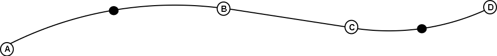

[#_7_3]
=== Sur des pentes glissantes – Types de lignes

Peut-être que surgira l'idée de décrire le tracé de la piste non pas à l'aide de segments de droite et d'arcs de cercle mais au moyen de formes géométriques plus élaborées telles que des clothoïdes, des fonctions splines ou des courbes de Bézier, par exemple. INTERLIS 2 ne propose pas directement de telles courbes mais accepte la définition de nouvelles formes pour les tronçons de lignes.

Une ligne se compose d'un ensemble ordonné de tronçons de lignes. Il s'agit pour ceux-ci d'extensions concrètes de la structure abstraite _LineSegment_. Quiconque souhaite recourir à des types de segments de lignes autres que ceux prédéfinis (segments de droite et arcs de cercle), peut étendre _LineSegment_ par une structure adéquate.

Une telle définition est à nouveau à établir en accord avec les producteurs, puisqu'en définitive, ce sont les systèmes qui doivent gérer les types de lignes. On souhaiterait en particulier que les lignes soient correctement représentées sur l'écran comme sur les sorties papier.

.Les lignes d'INTERLIS se composent d'une suite de segments. Les segments de droite et les arcs de cercle sont prédéfinis. La structure abstraite pour les segments de lignes peut cependant être étendue à des formes supplémentaires.
image::img/image75.png[]

Le point final de tout segment est simultanément le point initial du suivant, de sorte que le point initial ne fait pas partie du segment de ligne. Un segment initial spécial définit le point de départ du premier tronçon de ligne.

Un arc de cercle est insuffisamment défini par l'indication du seul point final, de sorte que les arcs de cercle se voient associer un point auxiliaire complémentaire faisant également partie de la ligne. Il doit se trouver à mi-chemin à peu près du début et de la fin du segment car ainsi le calcul en devient plus précis.

.Cette ligne se compose de quatre segments : le segment initial avec le point final A, un arc de cercle se terminant au point B, un segment de droite jusqu'au point C puis un nouvel arc de cercle avec le point D pour extrémité. Les points auxiliaires des deux arcs de cercles se trouvent sur les portions de courbes concernées et sont figurés en noir.

Il va de soi que le rayon d'un arc de cercle peut toujours être calculé à partir des cordonnées des points d'appui. Des imprécisions numériques peuvent cependant conduire à ce que la valeur calculée diffère de celle prévue, ce qui n'est pas acceptable si une signification conceptuelle est attachée au rayon dans le cadre de l'application. C'est pourquoi les arcs de cercle peuvent se voir affecter en option une valeur pour le rayon.

Lorsque le rayon est indiqué, la position exacte de la ligne est déterminée au moyen de cette valeur. Le point auxiliaire ne sert plus alors qu'à la sélection de l'une des quatre lignes de raccordement possibles.

.Lorsque le rayon _r_ est indiqué, le point auxiliaire H ne sert plus qu'à la sélection de l'une des quatre lignes possibles pour le raccordement des points A et B.
image::img/image77.png[]

