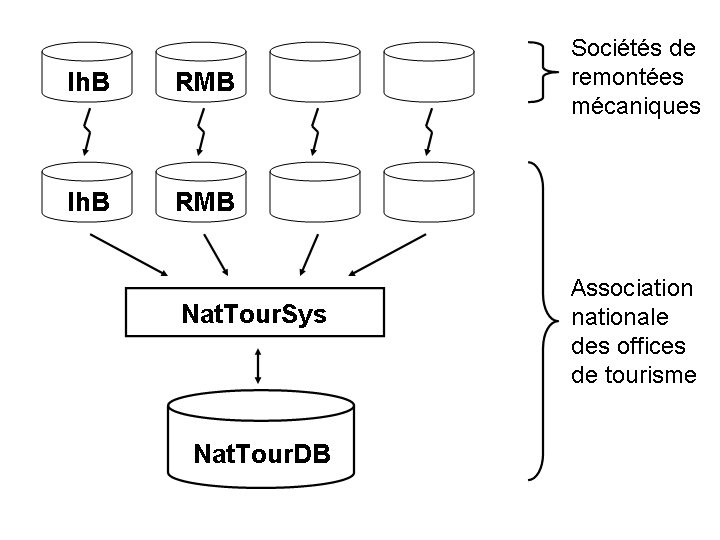

[#_8_4]
=== Les montagnes bleues sont elles aussi touristiques – Conteneurs, répliques, lecture polymorphe

L'Association nationale des offices de tourisme ne reçoit pas uniquement des données du Val d'Ili, mais de 163 régions différentes. Elle ne voudrait donc pas avoir à se préoccuper de la manière dont chacune de celles-ci souhaite gérer ses propres données mais se contenter de recevoir de temps à autre une livraison complémentaire contenant les données réactualisées de la région concernée.

Dans les régions, les données sont gérées dans les banques de données des systèmes utilisés. Dans le cadre d'INTERLIS, on part de l'hypothèse que les données de chacun des thèmes du modèle sont mémorisées dans un ou plusieurs conteneurs de données. Ainsi, les données relatives aux lignes des Remontées mécaniques de la Dent d'Ili sont-elles gérées dans un conteneur et celles des Remontés mécaniques des montagnes bleues dans un autre. Si les données des Remontées mécaniques de la Dent d'Ili ou celles des Remontées mécaniques des montagnes bleues sont à présent transmises à l'Association nationale des offices de tourisme, le conteneur concerné apparaît également dans le fichier de transfert. Le système informatique de l'Association nationale (NatTourSys) lit les données et met la banque de données NatTourDB à jour. La provenance des objets peut être établie lors de ce processus.

.L'Association nationale des offices de tourisme reçoit de temps à autre une livraison complémentaire de données touristiques transmises par les Remontées mécaniques de la Dent d'Ili, les Remontées mécaniques des montagnes bleues ou par toute autre entreprise affiliée à l'Association.

Ainsi, les données relatives au tire-fesses du Val d'Ili sont donc disponibles deux fois : auprès des Remontées mécaniques de la Dent d'Ili et auprès de l'Association nationale des offices de tourisme. Cela ne signifie bien évidemment pas que les enfants peuvent godiller sur une nouvelle piste dans le Val d'Ili. Seules les données ont été copiées, aucune nouvelle remontée n'a été construite !

Au plan informatique, les choses sont également claires puisque les deux objets de données portent la même identification. Il s'agit donc de répliques, représentant le même tire-fesses existant réellement.

Les notions suivantes sont apparentées aux répliques : substitut, duplicata, objet proxy.

Il est important que l'identification d'objet (telle que «xBOTOURDI04231336» dans l'exemple précédent) soit véritablement unique. Si tel n'est pas le cas, les Remontées mécaniques de la Dent d'Ili et celles des montagnes bleues pourraient accidentellement utiliser la même identification pour deux objets différents. Et par suite, il ne serait pas clair pour l'Association nationale des offices de tourisme, lors d'une livraison incrémentielle, si la modification concerne un objet du Val d'Ili ou des montagnes bleues.

Un service administratif béotien (« BO ») ayant attribué l'identification « BOTOU » à l'Association nationale des offices de tourisme, cette dernière a ensuite figé la première partie de l'identification attribuée à chaque société de remontées mécaniques (par exemple « BOTOURDI » pour les Remontées mécaniques de la Dent d'Ili et « BOTOURMB » pour les Remontées mécaniques des montagnes bleues). Le reste de l'identification incombe alors à chaque entreprise de transport ou plus précisément au logiciel qu'elle met en œuvre.

Les identifications d'objets n'ont pas la même signification dans le cadre d'un transfert intégral et dans celui d'une livraison incrémentielle : elles n'ont pas à être reçues, leur seul rôle consiste à permettre la reconstitution des relations entre les différents objets (par exemple entre les zones tarifaires et les types de billets). 

[#_8_5]
